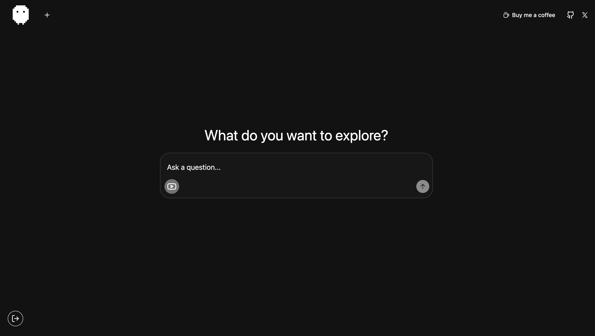

# yurei app

### still in progress, not live on https://yurei.app/ yet, but you can clone it and try it out

## a simple opensource social media researcher powered by exa ai api and youtube v3. built with vercel's ai sdk.

what it does:
- searches youtube for videos
- searches reddit for posts
- searches linkedin (kinda fucked rn, working on it)

using grok-21212 as the llm

### how to install

1. clone this repo
2. `npm install` or `yarn`
3. make a `.env.local` with: